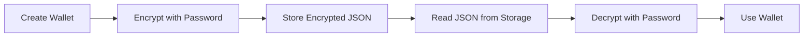

## Method Signature

```typescript
align.blockchain.wallets.createFromEncrypted(
  encrypted: string,
  password: string
): Promise<Wallet>
```

## Parameters

<ParamField body="encrypted" type="string" required>
  The encrypted wallet JSON string (keystore format)
</ParamField>

<ParamField body="password" type="string" required>
  The password used to encrypt the wallet
</ParamField>

## Returns

<ResponseField name="address" type="string">
  The wallet's public address
</ResponseField>

<ResponseField name="privateKey" type="string">
  The decrypted private key
</ResponseField>

## Examples

<Tabs>
  <Tab title="TypeScript">
    ```typescript
    import Align from "@tolbel/align";

    const align = new Align({
      apiKey: process.env.ALIGN_API_KEY!,
      environment: "sandbox",
    });

    // Encrypted keystore JSON (typically stored in a file or database)
    const encryptedJson = `{
      "address": "742d35cc6634c0532925a3b844bc9e7595f0ab42",
      "crypto": {
        "cipher": "aes-128-ctr",
        "ciphertext": "...",
        "kdf": "scrypt",
        ...
      }
    }`;

    const wallet = await align.blockchain.wallets.createFromEncrypted(
      encryptedJson,
      "mySecurePassword123"
    );

    console.log(`Decrypted wallet: ${wallet.address}`);
    ```

  </Tab>
  <Tab title="JavaScript">
    ```javascript
    const wallet = await align.blockchain.wallets.createFromEncrypted(
      encryptedJson,
      password
    );
    console.log("Address:", wallet.address);
    ```
  </Tab>
</Tabs>

### Load from File

```typescript
import fs from "fs";

// Read keystore file
const keystorePath = "./keystore/wallet.json";
const encryptedJson = fs.readFileSync(keystorePath, "utf8");

// Decrypt with password
const wallet = await align.blockchain.wallets.createFromEncrypted(
  encryptedJson,
  process.env.WALLET_PASSWORD!
);
```

## Encryption/Decryption Flow



<Info>
  Decryption can take several seconds as it's intentionally slow (using scrypt)
  to prevent brute-force attacks.
</Info>

## Related Methods

<CardGroup cols={2}>
  <Card
    title="Encrypt Private Key"
    icon="lock"
    href="/docs/api/blockchain/wallets/encrypt-private-key"
  >
    Encrypt a wallet
  </Card>
  <Card
    title="Create Wallet"
    icon="wallet"
    href="/docs/api/blockchain/wallets/create"
  >
    Create new wallet
  </Card>
</CardGroup>
