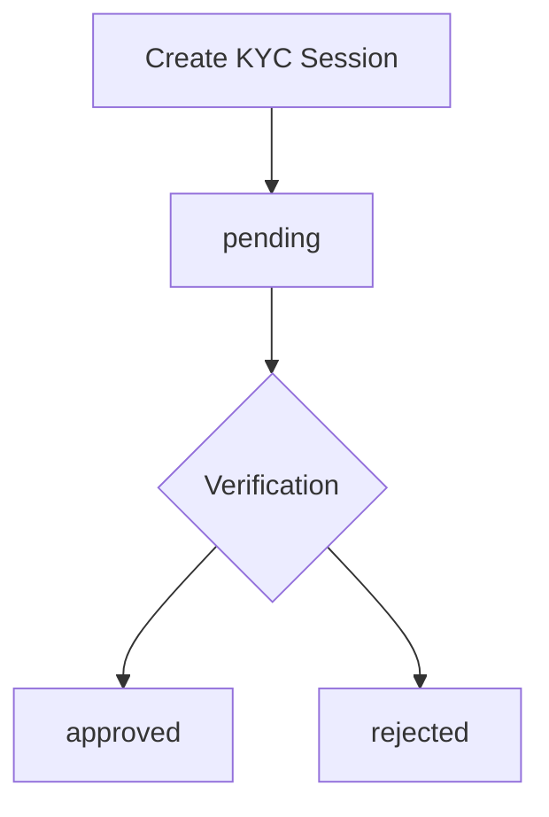

<Info>
  KYC verification is **required** before customers can create virtual accounts
  or process transfers.
</Info>

## Method Signature

```typescript
align.customers.createKycSession(customerId: string): Promise<KycSessionResponse>
```

## Parameters

<ParamField path="customerId" type="string" required>
  The unique customer identifier (UUID format)
</ParamField>

## Returns

<ResponseField name="kycs" type="object">
  KYC session information
  <Expandable title="KYC Object Properties">
    <ResponseField name="kycs.kyc_flow_link" type="string">
      URL for the customer to complete KYC verification
    </ResponseField>
  </Expandable>
</ResponseField>

## Examples

### Basic Usage

<Tabs>
  <Tab title="TypeScript">
    ```typescript
    import Align from "@tolbel/align";

    const align = new Align({
      apiKey: process.env.ALIGN_API_KEY!,
      environment: "sandbox",
    });

    const kycSession = await align.customers.createKycSession(
      "123e4567-e89b-12d3-a456-426614174000"
    );

    console.log(`KYC Link: ${kycSession.kycs.kyc_flow_link}`);
    // https://kyc.alignlabs.dev/flow/abc123...

    // Redirect user to this link to complete verification
    ```

  </Tab>
  <Tab title="JavaScript">
    ```javascript
    const kycSession = await align.customers.createKycSession(
      "123e4567-e89b-12d3-a456-426614174000"
    );

    console.log("KYC Link:", kycSession.kycs.kyc_flow_link);
    ```

  </Tab>
</Tabs>

### Frontend Integration

Send the KYC link to your frontend for user redirect:

```typescript
// Backend API endpoint
app.post("/api/kyc-session", async (req, res) => {
  const { customerId } = req.body;

  const session = await align.customers.createKycSession(customerId);

  res.json({
    kycUrl: session.kycs.kyc_flow_link,
  });
});
```

```javascript
// Frontend redirect
const response = await fetch("/api/kyc-session", {
  method: "POST",
  body: JSON.stringify({ customerId }),
});

const { kycUrl } = await response.json();

// Option 1: Redirect in same window
window.location.href = kycUrl;

// Option 2: Open in new tab
window.open(kycUrl, "_blank");

// Option 3: Embed in iframe (if allowed)
document.getElementById("kyc-frame").src = kycUrl;
```

### Response Example

```json
{
  "kycs": {
    "kyc_flow_link": "https://kyc.alignlabs.dev/flow/abc123def456"
  }
}
```

## KYC Status Flow



| Status     | Sub-Status                       | Description                        |
| ---------- | -------------------------------- | ---------------------------------- |
| `pending`  | `kyc_form_submission_started`    | User has started the verification  |
| `approved` | `kyc_form_submission_accepted`   | Verification successful            |
| `rejected` | `kyc_form_resubmission_required` | Verification requires more details |

<Warning>
  KYC links expire after a certain period. If the link expires, call this method
  again to generate a new one.
</Warning>

## Sandbox Testing

In the sandbox environment, simulate KYC approval without completing the actual flow:

```typescript
// Create customer
const customer = await align.customers.create({
  email: "test@example.com",
  type: "individual",
  first_name: "Test",
  last_name: "User",
});

// Create KYC session
await align.customers.createKycSession(customer.customer_id);

// Simulate approval (sandbox only!)
await align.customers.simulateCustomer({
  customer_id: customer.customer_id,
  action: "kyc.status.approve",
});

// Customer is now KYC-approved
const updated = await align.customers.get(customer.customer_id);
console.log(updated.kycs?.sub_status);
// "kyc_form_submission_accepted"
```

## Related Methods

<CardGroup cols={2}>
  <Card
    title="Create Customer"
    icon="user-plus"
    href="/docs/api/customers/create"
  >
    Create a customer first
  </Card>
  <Card
    title="Simulate Customer"
    icon="flask"
    href="/docs/api/customers/simulate-customer"
  >
    Test KYC approval in sandbox
  </Card>
  <Card title="Get Customer" icon="user" href="/docs/api/customers/get">
    Check KYC status
  </Card>
</CardGroup>
