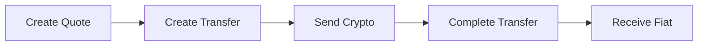

<Info>
  This is only required for offramp transfers where you're sending crypto from
  your own wallet to the platform.
</Info>

## Method Signature

```typescript
align.transfers.completeOfframpTransfer(
  customerId: string,
  transferId: string,
  data: CompleteOfframpTransferRequest
): Promise<Transfer>
```

## Parameters

<ParamField path="customerId" type="string" required>
  The unique customer identifier
</ParamField>

<ParamField path="transferId" type="string" required>
  The unique transfer identifier
</ParamField>

<ParamField body="deposit_transaction_hash" type="string" required>
  Blockchain transaction hash of the crypto transfer
</ParamField>

## Example

<Tabs>
  <Tab title="TypeScript">
    ```typescript
    import Align from "@tolbel/align";

    const align = new Align({
      apiKey: process.env.ALIGN_API_KEY!,
      environment: "sandbox",
    });

    // After sending crypto to the platform's address
    const completed = await align.transfers.completeOfframpTransfer(
      "123e4567-e89b-12d3-a456-426614174000",
      "tr_123e4567-e89b-12d3-a456-426614174000",
      {
        deposit_transaction_hash: "0x1234567890abcdef...",
      }
    );

    console.log(`Status: ${completed.status}`);
    // Status: processing
    ```

  </Tab>
  <Tab title="JavaScript">
    ```javascript
    const completed = await align.transfers.completeOfframpTransfer(
      "123e4567-e89b-12d3-a456-426614174000",
      "tr_123e4567-e89b-12d3-a456-426614174000",
      {
        deposit_transaction_hash: "0x1234567890abcdef...",
      }
    );

    console.log("Status:", completed.status);
    ```

  </Tab>
</Tabs>

## Offramp Flow



1. **Create Quote** - Get exchange rate and fees
2. **Create Transfer** - Initialize the transfer
3. **Send Crypto** - Send crypto to the provided address
4. **Complete Transfer** - Submit the tx hash (this step)
5. **Receive Fiat** - Fiat is sent to the bank account

<Warning>
  Ensure the transaction is confirmed on the blockchain before calling this
  method.
</Warning>

## Related Methods

<CardGroup cols={2}>
  <Card
    title="Create Transfer"
    icon="paper-plane"
    href="/docs/api/transfers/create-transfer"
  >
    Create the transfer first
  </Card>
  <Card
    title="Get Offramp Transfer"
    icon="eye"
    href="/docs/api/transfers/get-offramp-transfer"
  >
    Track completion status
  </Card>
</CardGroup>
