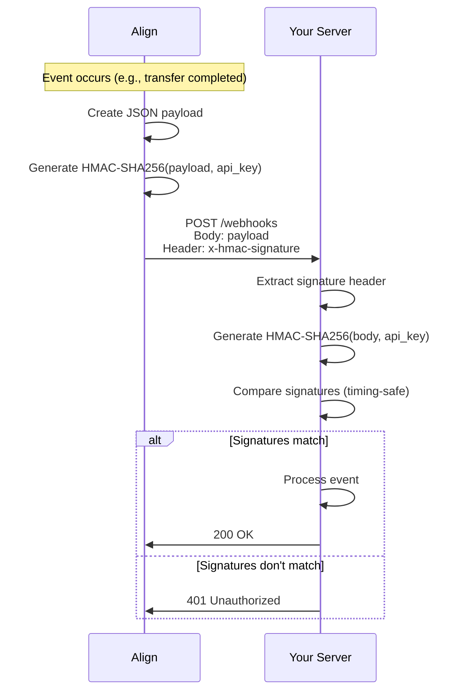

# Verify Webhook Signature

Verify that incoming webhook requests are authentic by validating their HMAC-SHA256 signature. This is **critical for security** to prevent malicious actors from spoofing webhook events.

<Warning>
  **Always verify webhook signatures in production!** Failing to do so exposes
  your application to forged webhook attacks.
</Warning>

## Method Signature

```typescript
align.webhooks.verifySignature(
  payload: string,
  signature: string,
  secret?: string
): boolean
```

## Parameters

<ParamField body="payload" type="string" required>
  The raw request body as a string. Must be the exact bytes received, before any
  JSON parsing.
</ParamField>

<ParamField body="signature" type="string" required>
  The signature from the `x-hmac-signature` header
</ParamField>

<ParamField body="secret" type="string">
  Your API key (used as the HMAC secret). If not provided, uses the API key from
  the SDK configuration.
</ParamField>

## Returns

Returns `true` if the signature is valid, `false` otherwise.

## Examples

### Express.js Integration

<Tabs>
  <Tab title="TypeScript">
    ```typescript
    import express from "express";
    import Align from "@tolbel/align";

    const app = express();
    const align = new Align({
      apiKey: process.env.ALIGN_API_KEY!,
      environment: "production",
    });

    // IMPORTANT: Use express.raw() to get the raw body
    app.post(
      "/webhooks/align",
      express.raw({ type: "application/json" }),
      (req, res) => {
        // Get signature from header
        const signature = req.headers["x-hmac-signature"] as string;

        if (!signature) {
          return res.status(401).send("Missing signature");
        }

        // Get raw body as string
        const payload = req.body.toString("utf8");

        // Verify the signature
        const isValid = align.webhooks.verifySignature(payload, signature);

        if (!isValid) {
          console.error("Invalid webhook signature!");
          return res.status(401).send("Invalid signature");
        }

        // Parse and process the event
        const event = JSON.parse(payload);
        console.log(`Received: ${event.event_type}`);

        // Handle different event types
        switch (event.event_type) {
          case "transfer.completed":
            handleTransferCompleted(event.data);
            break;
          case "virtual_account.credit":
            handleDeposit(event.data);
            break;
          case "customer.kyc.approved":
            handleKycApproved(event.data);
            break;
        }

        res.status(200).send("OK");
      }
    );

    app.listen(3000);
    ```

  </Tab>
  <Tab title="JavaScript">
    ```javascript
    const express = require("express");
    const Align = require("@tolbel/align").default;

    const app = express();
    const align = new Align({
      apiKey: process.env.ALIGN_API_KEY,
      environment: "production",
    });

    app.post(
      "/webhooks/align",
      express.raw({ type: "application/json" }),
      (req, res) => {
        const signature = req.headers["x-hmac-signature"];
        const payload = req.body.toString("utf8");

        if (!align.webhooks.verifySignature(payload, signature)) {
          return res.status(401).send("Invalid signature");
        }

        const event = JSON.parse(payload);
        console.log("Event:", event.event_type);

        res.status(200).send("OK");
      }
    );
    ```

  </Tab>
</Tabs>

### Next.js API Route

```typescript
// app/api/webhooks/align/route.ts
import { NextRequest, NextResponse } from "next/server";
import Align from "@tolbel/align";

const align = new Align({
  apiKey: process.env.ALIGN_API_KEY!,
  environment: "production",
});

export async function POST(request: NextRequest) {
  const payload = await request.text();
  const signature = request.headers.get("x-hmac-signature");

  if (!signature) {
    return NextResponse.json({ error: "Missing signature" }, { status: 401 });
  }

  if (!align.webhooks.verifySignature(payload, signature)) {
    return NextResponse.json({ error: "Invalid signature" }, { status: 401 });
  }

  const event = JSON.parse(payload);

  // Process event...

  return NextResponse.json({ received: true });
}
```

### Hono Integration

```typescript
import { Hono } from "hono";
import Align from "@tolbel/align";

const app = new Hono();
const align = new Align({
  apiKey: process.env.ALIGN_API_KEY!,
  environment: "production",
});

app.post("/webhooks/align", async (c) => {
  const payload = await c.req.text();
  const signature = c.req.header("x-hmac-signature");

  if (!signature || !align.webhooks.verifySignature(payload, signature)) {
    return c.json({ error: "Unauthorized" }, 401);
  }

  const event = JSON.parse(payload);
  console.log(`Event: ${event.event_type}`);

  return c.json({ ok: true });
});
```

## How Signature Verification Works



## Security Best Practices

<AccordionGroup>
  <Accordion title="Always use raw body">
    You must use the **raw request body** exactly as received. Parsing the JSON first and re-stringifying it may change the byte order, causing verification to fail.
    
    ```typescript
    // ✅ Correct - use raw body
    app.post("/webhooks", express.raw({ type: "application/json" }), ...);
    
    // ❌ Wrong - JSON parsed first
    app.post("/webhooks", express.json(), (req, res) => {
      const payload = JSON.stringify(req.body); // May differ from original!
    });
    ```
  </Accordion>
  
  <Accordion title="Use timing-safe comparison">
    The SDK uses `crypto.timingSafeEqual()` internally to prevent timing attacks. Never implement your own signature comparison with `===`.
  </Accordion>
  
  <Accordion title="Handle failures gracefully">
    If signature verification fails:
    1. Return 401 immediately
    2. Log the failure for monitoring
    3. **Do not process the event**
    
    ```typescript
    if (!align.webhooks.verifySignature(payload, signature)) {
      console.error("Webhook signature verification failed", {
        ip: req.ip,
        userAgent: req.headers["user-agent"],
      });
      return res.status(401).send("Unauthorized");
    }
    ```
  </Accordion>
  
  <Accordion title="Protect your API key">
    Your API key is used as the HMAC secret. Keep it secure:
    - Store in environment variables
    - Never commit to version control
    - Rotate if compromised
  </Accordion>
</AccordionGroup>

## Testing Webhook Signatures

For testing, you can generate signatures manually:

```typescript
import crypto from "crypto";

function generateTestSignature(payload: string, secret: string): string {
  return crypto.createHmac("sha256", secret).update(payload).digest("hex");
}

// Generate a test signature
const payload = JSON.stringify({ event_type: "test", data: {} });
const signature = generateTestSignature(payload, "your_api_key");

// This should return true
const isValid = align.webhooks.verifySignature(payload, signature);
console.log("Valid:", isValid); // true
```

## Related Methods

<CardGroup cols={2}>
  <Card title="Create Webhook" icon="bell" href="/docs/api/webhooks/create">
    Register webhook endpoints
  </Card>
  <Card title="List Webhooks" icon="list" href="/docs/api/webhooks/list">
    View all webhooks
  </Card>
</CardGroup>
