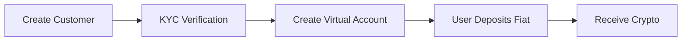

# Quick Start

This guide walks you through the essential steps to integrate the Align SDK into your application.

<Note>
  Make sure you've completed the [installation](/docs/installation) before
  proceeding.
</Note>

## Initialize the Client

Create an Align client instance with your API credentials:

<Tabs>
  <Tab title="TypeScript">
    ```typescript
    import Align from "@tolbel/align";

    const align = new Align({
      apiKey: process.env.ALIGN_API_KEY!,
      environment: "sandbox", // Use "production" for live transactions
    });
    ```

  </Tab>
  <Tab title="JavaScript">
    ```javascript
    const Align = require("@tolbel/align").default;

    const align = new Align({
      apiKey: process.env.ALIGN_API_KEY,
      environment: "sandbox",
    });
    ```

  </Tab>
</Tabs>

### Configuration Options

| Option          | Type                          | Default        | Description                            |
| --------------- | ----------------------------- | -------------- | -------------------------------------- |
| `apiKey`        | `string`                      | -              | Your AlignLab API key (required)       |
| `environment`   | `"sandbox"` \| `"production"` | `"production"` | API environment                        |
| `timeout`       | `number`                      | `30000`        | Request timeout in milliseconds        |
| `maxRetries`    | `number`                      | `3`            | Max retry attempts for failed requests |
| `enableLogging` | `boolean`                     | `false`        | Enable request/response logging        |

## Core Workflow

Here's the typical integration flow for processing payments:



<Steps>
  <Step title="Create a Customer">
    Register a new user in the Align system:
    
    ```typescript
    const customer = await align.customers.create({
      email: "alice@example.com",
      type: "individual",
      first_name: "Alice",
      last_name: "Smith",
    });

    console.log(`Customer ID: ${customer.customer_id}`);
    // Customer ID: 123e4567-e89b-12d3-a456-426614174000
    ```

    <Tip>
    For businesses, use `type: "corporate"` and provide `company_name` instead of first/last name.
    </Tip>

  </Step>
  
  <Step title="Complete KYC Verification">
    Generate a KYC verification link for your user:
    
    ```typescript
    const kycSession = await align.customers.createKycSession(
      customer.customer_id
    );

    // Redirect user to complete verification
    console.log(`KYC Link: ${kycSession.kycs.kyc_flow_link}`);
    // https://kyc.alignlabs.dev/flow/...
    ```

    <Warning>
    Users must complete KYC before creating virtual accounts or processing transfers.
    </Warning>

    **In Sandbox**, you can simulate KYC approval:

    ```typescript
    await align.customers.simulateCustomer({
      customer_id: customer.customer_id,
      action: "kyc.status.approve",
    });
    ```

  </Step>
  
  <Step title="Create a Virtual Account">
    Once KYC is approved, create a virtual bank account for deposits:
    
    ```typescript
    const virtualAccount = await align.virtualAccounts.create(
      customer.customer_id,
      {
        source_currency: "usd",
        source_rails: "ach",
        destination_token: "usdc",
        destination_network: "polygon",
      }
    );

    // Get deposit instructions
    const instructions = virtualAccount.deposit_instructions;
    console.log(`Account Number: ${instructions.account_number}`);
    console.log(`Routing Number: ${instructions.routing_number}`);
    ```

    <Info>
    Deposit instructions vary by payment rails. ACH accounts have routing numbers, while IBAN accounts have BIC/SWIFT codes.
    </Info>

  </Step>
  
  <Step title="Process Deposits">
    When users deposit fiat to their virtual account, funds are automatically converted and sent to their crypto wallet.
    
    Simulate a deposit in sandbox:
    
    ```typescript
    await align.virtualAccounts.simulate(virtualAccount.id, {
      amount: "100.00",
    });

    // Check virtual account for updated balance
    const updated = await align.virtualAccounts.get(virtualAccount.id);
    console.log(`Status: ${updated.status}`);
    ```

  </Step>
</Steps>

## Creating Transfers

For more control over conversions, use the Transfers API:

### Onramp (Fiat → Crypto)

```typescript
// Step 1: Get a quote
const quote = await align.transfers.createOnrampQuote(customer.customer_id, {
  source_amount: "100.00",
  source_currency: "usd",
  source_payment_rails: "ach",
  destination_token: "usdc",
  destination_network: "polygon",
});

console.log(`You'll receive: ${quote.destination_amount} USDC`);
console.log(`Fee: ${quote.fee_amount} USD`);

// Step 2: Execute the transfer
const transfer = await align.transfers.createOnrampTransfer(
  customer.customer_id,
  {
    quote_id: quote.quote_id,
    destination_wallet_address: "0x...",
  }
);
```

### Offramp (Crypto → Fiat)

```typescript
// Step 1: Link a bank account
const externalAccount = await align.externalAccounts.create(
  customer.customer_id,
  {
    type: "us",
    account_holder_name: "Alice Smith",
    routing_number: "021000021",
    account_number: "123456789",
    account_type: "checking",
  }
);

// Step 2: Get a quote
const quote = await align.transfers.createOfframpQuote(customer.customer_id, {
  source_amount: "100.00",
  source_token: "usdc",
  source_network: "polygon",
  destination_currency: "usd",
  destination_payment_rails: "ach",
});

// Step 3: Execute the transfer
const transfer = await align.transfers.createOfframpTransfer(
  customer.customer_id,
  {
    quote_id: quote.quote_id,
    external_account_id: externalAccount.external_account_id,
    source_wallet_address: "0x...",
  }
);
```

## Error Handling

Always wrap API calls in try-catch blocks:

```typescript
import Align, { AlignError, AlignValidationError } from "@tolbel/align";

try {
  const customer = await align.customers.create({
    email: "invalid-email",
    type: "individual",
    first_name: "Alice",
    last_name: "Smith",
  });
} catch (error) {
  if (error instanceof AlignValidationError) {
    // Request validation failed (before API call)
    console.error("Validation Error:", error.errors);
  } else if (error instanceof AlignError) {
    // API returned an error
    console.error("API Error:", error.message);
    console.error("Status:", error.statusCode);
  } else {
    // Network or other error
    throw error;
  }
}
```

<Card
  title="Error Handling Guide"
  icon="triangle-exclamation"
  href="/docs/error-handling"
>
  Learn more about error types and handling strategies
</Card>

## Webhook Integration

Set up webhooks to receive real-time notifications:

```typescript
// Register a webhook endpoint
const webhook = await align.webhooks.create({
  url: "https://your-app.com/webhooks/align",
  events: ["transfer.completed", "transfer.failed", "virtual_account.credit"],
});

console.log(`Webhook Secret: ${webhook.secret}`);
```

<Warning>
  Store the webhook secret securely. You'll need it to verify incoming webhook
  signatures.
</Warning>

## Next Steps

<CardGroup cols={2}>
  <Card title="Customer API" icon="user" href="/docs/api/customers/create">
    Learn about customer management
  </Card>
  <Card
    title="Virtual Accounts"
    icon="building-columns"
    href="/docs/api/virtual-accounts/create"
  >
    Deep dive into virtual accounts
  </Card>
  <Card
    title="Transfers API"
    icon="arrows-left-right"
    href="/docs/api/transfers/create-quote"
  >
    Explore transfer options
  </Card>
  <Card
    title="Error Handling"
    icon="triangle-exclamation"
    href="/docs/error-handling"
  >
    Handle errors gracefully
  </Card>
</CardGroup>
